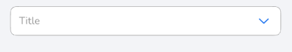
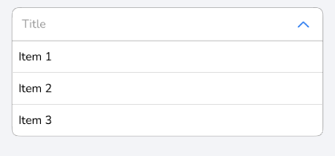

# DHLCustomDropDown

Desplegable para seleccionar un elemento de una lista.


## Preview



## Installation

### CocoaPods

```ruby
pod 'DHLCustomDropDown'
```

## Quick Start

### UIKit

The view height is calculated automatically; in the storyboard, you need to put a low priority height or placeholder/"remove at build time".

```swift
@IBOutlet weak var myDropDown: CustomDropDown!

myDropDown.setUp(
    title: "titulo",
    items: ["Item 1", "Item 2", "Item 3"],
    selectionType: .single,
    itemSelectedAction: { itemSelected, index in
        
    }
)

myDropDown.selectItem(itemToSelect: "Item 1")
```
